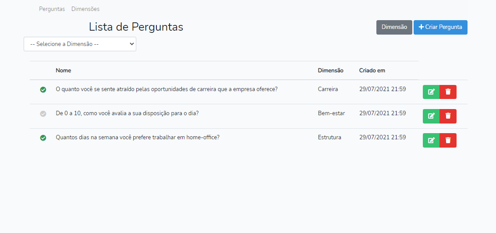

# Modulo de Pesquisa


## Sobre <a name = "about"></a>

Projeto de uma API REST em PHP com framework Laravel, que permite criar, ler, atualizar e excluir registros em um banco de dados, front-end com Vue e Bootstrap.

Pode-se criar, editar e excluir as perguntas e opções do instrumento.
Para isso foram criado as telas:
- Listagem de perguntas;
- Criação/edição da pergunta;
- Listagem de dimensões;
- Criação/edição de dimensão;



## Inicio <a name = "getting_started"></a>

Projeto desenvolvido em PHP v7.3, Laravel v8.5 e Vue v2.6

### Pré-requisito

PHP v7.3, Laravel v8.5 e Vue v2.6, composer v2.0 e node v15.0

### Instalação

- Clone o repositório com __git clone__ executando o comando:
```
git clone https://github.com/gilcleis/research-module.git
```
- Acesse o diretorio criado
- Crie uma copia do arqruivo __.env.example__ nomeando para __.env__ 

- configure as credencias de banco de dados no arquivo __.env__

```
DB_CONNECTION=mysql
DB_HOST=127.0.0.1
DB_PORT=3306
DB_DATABASE=research
DB_USERNAME=root
DB_PASSWORD=
```

- Execute o comando:

```
composer install
```
- Execute o comando:

```
php artisan key:generate
```
- Execute o comando:

```
php artisan migrate --seed
```
- Execute o comando :

```
npm install
```
- Execute o comando :

```
npm run dev
```

- Pronto, inicie o URL principal ou:
```
php artisan serve
```

